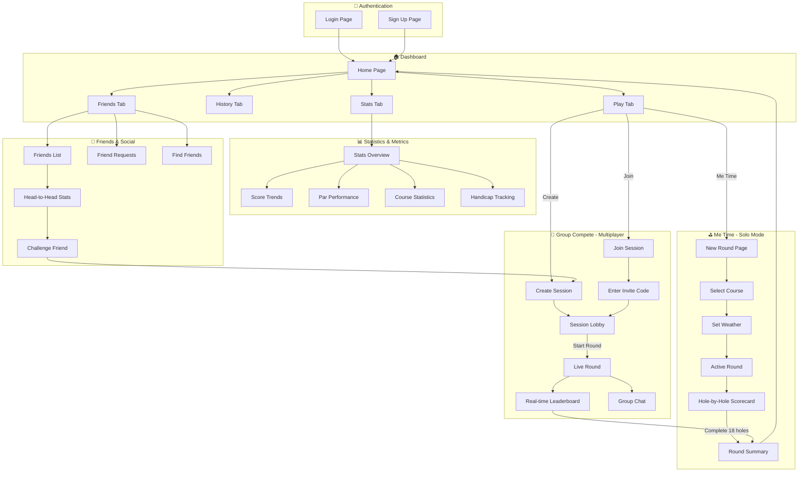
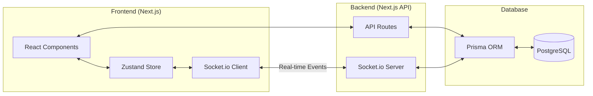
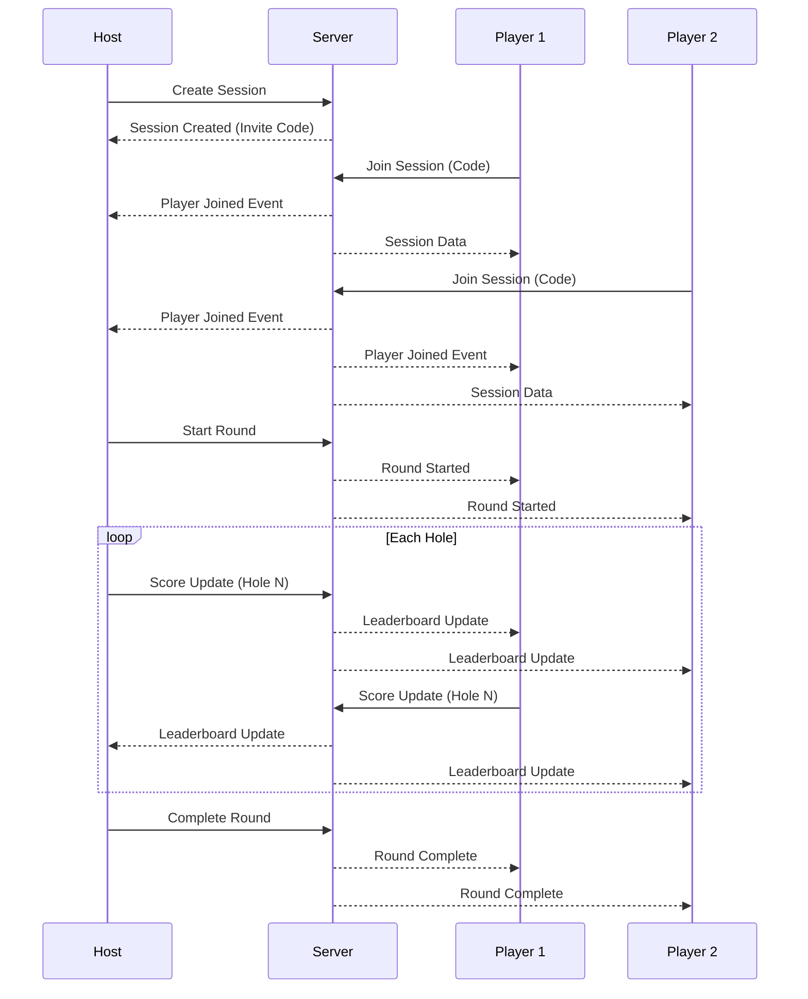
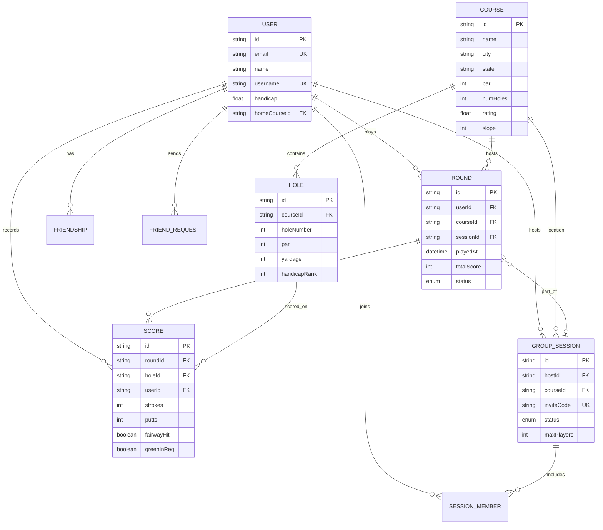

# Fairway Golf Tracker - App Architecture & Flow

## Overview
A web app for golfers to track scores over time, by location, with solo and multiplayer modes.

---

## User Flow Diagram



---

## Data Flow Diagram



---

## Real-time Events Flow (Group Mode)



---

## Database Schema Overview



---

## File Structure

```
golf-tracker/
├── prisma/
│   └── schema.prisma          # Database schema
├── src/
│   ├── app/
│   │   ├── api/
│   │   │   ├── friends/       # Friends API routes
│   │   │   ├── rounds/        # Rounds API routes
│   │   │   ├── scores/        # Scores API routes
│   │   │   ├── sessions/      # Group sessions API
│   │   │   └── stats/         # Statistics API
│   │   ├── friends/
│   │   │   └── page.tsx       # Friends management
│   │   ├── round/
│   │   │   ├── new/
│   │   │   │   └── page.tsx   # Start new round
│   │   │   └── [id]/
│   │   │       └── page.tsx   # Active round scorecard
│   │   ├── session/
│   │   │   ├── new/
│   │   │   │   └── page.tsx   # Create group session
│   │   │   ├── join/
│   │   │   │   └── page.tsx   # Join with invite code
│   │   │   └── [code]/
│   │   │       └── page.tsx   # Active group session
│   │   ├── stats/
│   │   │   └── page.tsx       # Detailed statistics
│   │   ├── globals.css        # Global styles
│   │   ├── layout.tsx         # Root layout
│   │   └── page.tsx           # Dashboard home
│   ├── components/
│   │   ├── providers.tsx      # Context providers
│   │   └── scorecard.tsx      # Scorecard components
│   ├── lib/
│   │   ├── auth.ts            # Authentication utils
│   │   ├── golf-utils.ts      # Golf scoring utilities
│   │   ├── prisma.ts          # Prisma client
│   │   └── socket.ts          # Socket.io setup
│   ├── stores/
│   │   └── index.ts           # Zustand state stores
│   └── types/
│       └── index.ts           # TypeScript types
├── tailwind.config.ts         # Tailwind configuration
└── package.json               # Dependencies
```

---

## Key Features Summary

| Feature | Description | Status |
|---------|-------------|--------|
| **Me Time Mode** | Solo round tracking with hole-by-hole scoring | ✅ Built |
| **Group Compete** | Real-time multiplayer with live leaderboard | ✅ Built |
| **Score Tracking** | Strokes, putts, FIR, GIR, penalties | ✅ Built |
| **Course Management** | Store and select golf courses | ✅ Built |
| **Statistics** | Trends, averages, par performance | ✅ Built |
| **Friends System** | Add friends, head-to-head records | ✅ Built |
| **Real-time Updates** | Socket.io for live score syncing | ✅ Built |
| **Responsive Design** | Mobile-first, works on all devices | ✅ Built |
